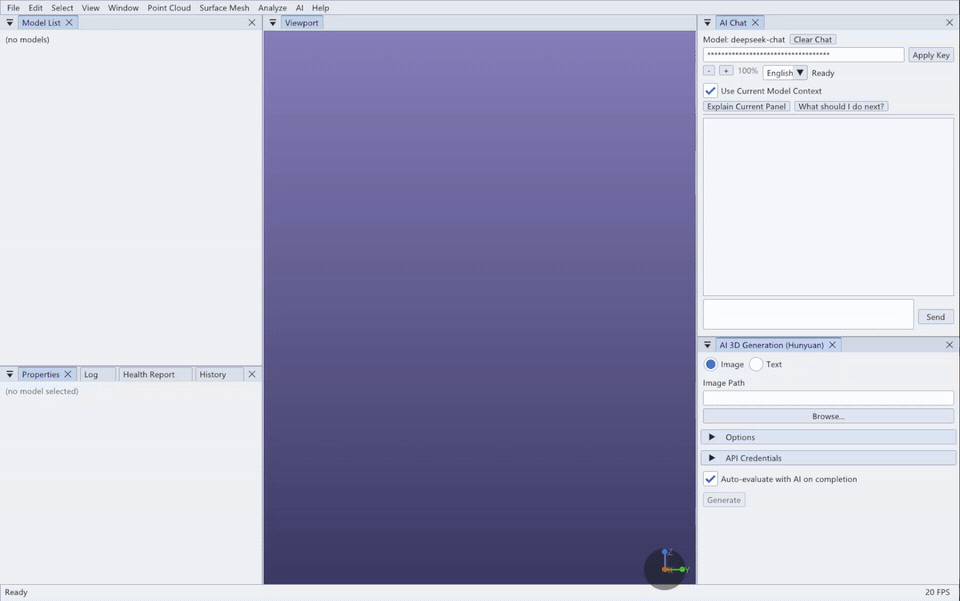
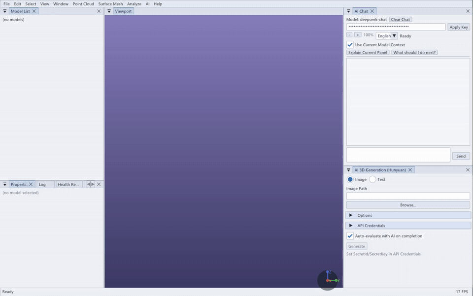
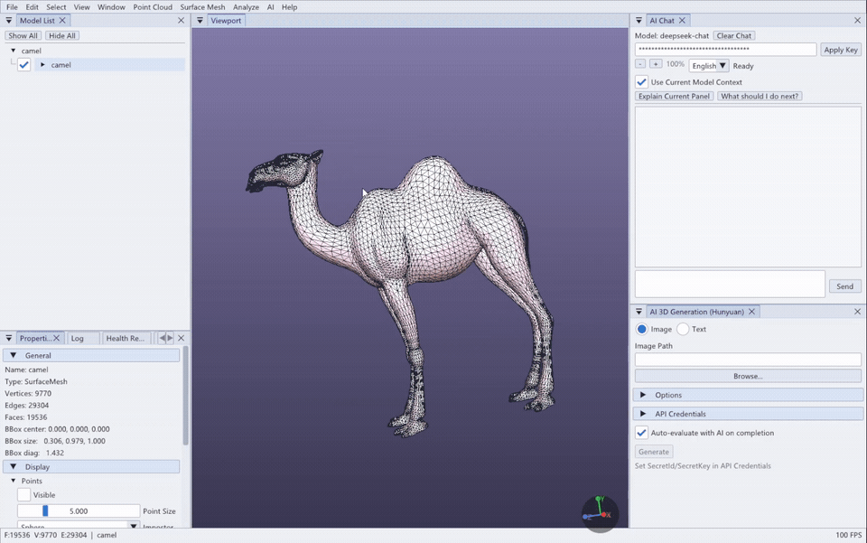
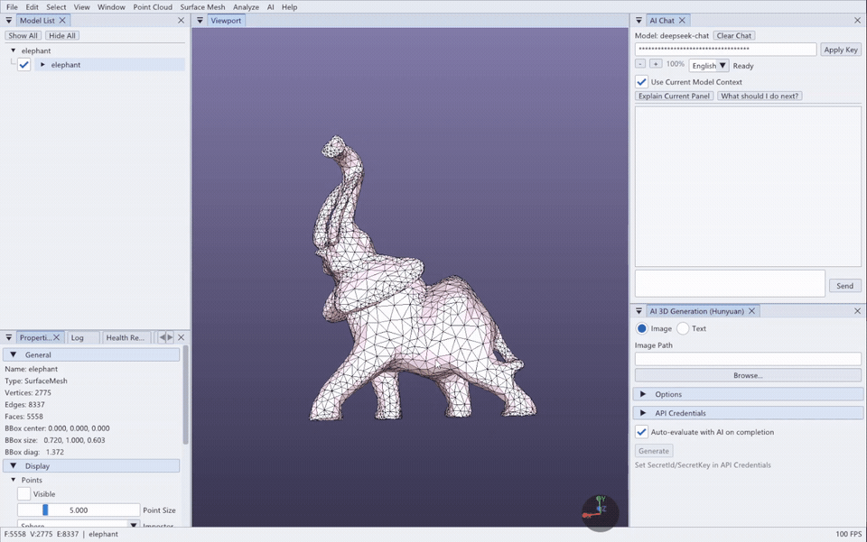
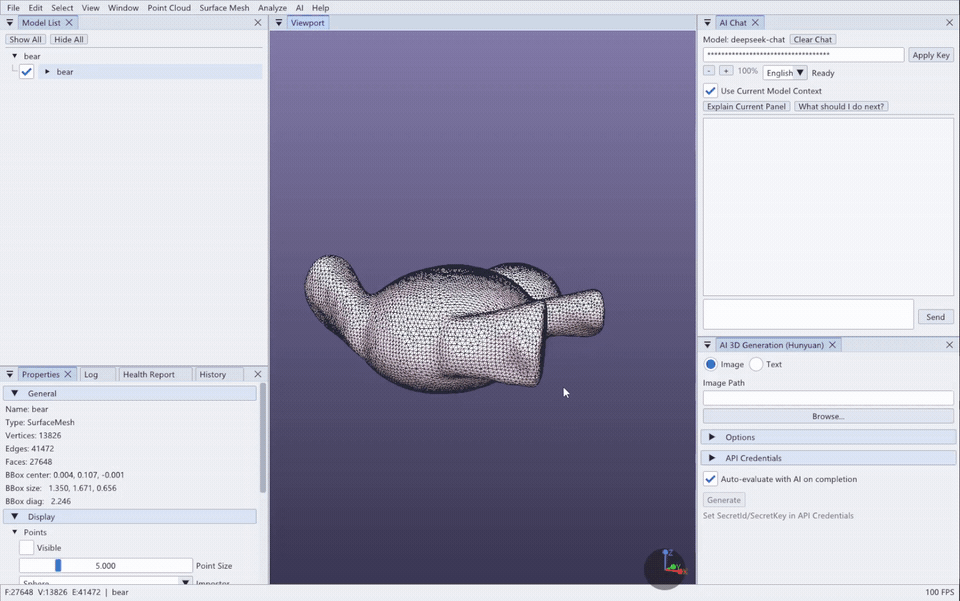

# 3D Claw

<p>
  
  
  
  
  
  
</p>

**3D Claw: An AI-assisted 3D geometry processing workspace built on Easy3D.**

3D Claw is a desktop workspace for inspecting, processing, generating, and
evaluating 3D geometry. It uses Easy3D as the geometry, rendering, file IO, and
viewer foundation, and adds product-level workflows for contextual AI
assistance, algorithm process visualization, model health inspection, and
AI-driven 3D generation.

The main idea is simple: geometry algorithms should not behave like isolated
black-box commands. In 3D Claw, AI can participate before, during, and after a
processing operation. It can help choose parameters from the current model
context, the application can expose visual intermediate states, and AI can
evaluate result metrics after an algorithm finishes.

## Feature Tour

### AI-Assisted 3D Generation

Generate a mesh from a text prompt, import it directly into the workspace, and
receive AI feedback on geometry quality, texture/UV risks, and recommended
post-processing steps.

<p align="center">
  
</p>

### Context-Aware AI Parameter Advice And Tuning

Algorithm panels can ask AI for parameter suggestions using the current model,
panel state, geometry statistics, and health-report signals. The example below
uses point-cloud region growing, a segmentation algorithm that groups nearby
points into coherent surface regions. The important point is the workflow:
parameters are not guessed in isolation; AI can react to the current model and
to the result that was just produced.

<p align="center">
  
</p>

### AI Result Evaluation After Geometry Processing

After supported algorithms finish, AI can review output metrics, geometry
counts, quality risks, and next steps. The example below uses mesh
simplification, which reduces triangle count while trying to preserve the
visible shape. The same result-evaluation pattern is used across algorithm
panels that expose enough runtime and output data.

<p align="center">
  
</p>

### Quality-Aware Feedback From Result Metrics

Some algorithms report quantitative result metrics. AI can use those metrics to
judge whether the operation was conservative or aggressive, and whether another
pass is worthwhile. The example below uses mesh smoothing, where displacement,
area/volume change, and triangle-quality changes are more important than a
simple success/failure flag.

<p align="center">
  
</p>

### Visual Algorithm Execution

Long-running geometry algorithms can expose previews, overlays, intermediate
states, and final outputs directly in the viewport. The example below uses MCF
skeletonization, an advanced surface-mesh algorithm that extracts a curve
skeleton. The broader feature is that algorithm execution is visible and
inspectable instead of being a silent black box.

<p align="center">
  
</p>

## Key Features

- Context-aware AI assistance from menus, panels, model-tree nodes, health
  reports, history entries, and algorithm dialogs.
- AI parameter advice that can include the active panel, selected model, model
  statistics, health-report signals, current algorithm parameters, and available
  result metrics.
- AI result evaluation after supported algorithms finish, including concrete
  post-processing suggestions.
- AI Chat with current model and panel context.
- Text/image-to-3D generation with automatic import into the workspace.
- Live visual feedback for long-running geometry algorithms.
- Dockable Dear ImGui interface with model tree, properties, health report,
  log, history, selection, measurement, crop, transform, and display tools.
- Textured OBJ and GLB loading support.
- CGAL-backed visual algorithms including Region Growing, RANSAC, Alpha
  Wrapping, Simplification, Smoothing, ACVD, VSA, Planar Patch Remeshing,
  Geodesic Distance, MCF Skeletonization, ARAP Deformation, and UV
  Parameterization.

## AI In The Geometry Loop

3D Claw treats AI as part of the geometry workflow rather than a detached chat
box.

| Stage | What 3D Claw Adds |
| --- | --- |
| Before running | AI can recommend algorithms and parameters from the current model, panel, and health context. |
| During running | Visual algorithms expose live progress, previews, overlays, and model-tree outputs when supported. |
| After running | AI can evaluate output statistics, result quality, topology risks, and next operations. |
| During generation | AI-generated meshes are imported as normal workspace models and can be inspected, styled, evaluated, and processed. |

The AI prompts are context-aware when the required data is available. They may
include model type, vertex/edge/face counts, bounding-box scale, normals, UV and
texture state, selected parameters, runtime summaries, health-report findings,
and algorithm result metrics.

## Algorithm Coverage

| Category | Examples |
| --- | --- |
| Point clouds | Downsampling, normal estimation, normal reorientation, Poisson reconstruction, RANSAC primitive extraction, region growing, Delaunay triangulation. |
| Surface meshes | Sampling, simplification, smoothing, fairing, hole filling, isotropic remeshing, topology repair, connected components. |
| Advanced CGAL workflows | Alpha Wrapping 3D, ACVD remeshing, VSA approximation, planar patch remeshing, MCF skeletonization, ARAP deformation, UV parameterization, geodesic distance. |
| Analysis | Health report, topology statistics, curvature, measurement, point-cloud/mesh distance, point-cloud/point-cloud distance. |
| AI workflows | Chat, contextual menu help, panel explanations, parameter advice, result evaluation, text/image-to-3D generation. |

CGAL-dependent algorithms require a CGAL-enabled build. In a core build with
CGAL disabled, the application still supports viewing, model IO, Easy3D-backed
tools, AI Chat, AI generation import, and non-CGAL services.

## Build Overview

Easy3D is consumed as an external CMake package through
`find_package(Easy3D REQUIRED ...)`. Easy3D source and backend-only dependency
bundles are not vendored in the public 3D Claw tree.

The recommended first validation path on a new machine is the core build with
CGAL disabled:

```bash
cmake --preset linux-gcc-cgal-off \
  -DEasy3D_DIR=<path-to-easy3d-install>/lib/CMake \
  -DCLAW3D_EASY3D_RESOURCE_DIR=<path-to-easy3d-resources> \
  -DCLAW3D_BUILD_TESTS=ON
cmake --build --preset linux-gcc-cgal-off-release --parallel
ctest --test-dir build/linux-gcc-cgal-off --output-on-failure
```

See [BUILDING.md](BUILDING.md) for the full Windows, Ubuntu 22.04, and macOS
build guide, including CGAL-on configuration.

## Documentation

- [User Manual](USER_MANUAL.md): interface, panels, menus, AI features,
  algorithms, parameters, use cases, and risks.
- [Build Guide](BUILDING.md): dependency policy, platform setup, CMake presets,
  CGAL-on/off builds, smoke tests, and troubleshooting.
- [Third-Party Notices](THIRD_PARTY_NOTICES.md): bundled and external
  third-party dependency attribution.

## Runtime Notes

- AI features are optional. The application should start without an API key.
- AI Chat keys are stored as plaintext in the local user configuration when
  saved. Redact credentials before sharing logs or config files.
- AI output is advisory. Geometry results should still be inspected visually and
  with the Health Report when topology or measurement quality matters.
- AI 3D generation requires valid service credentials and network access.
- Generated model outputs are loaded into the workspace and can be further
  inspected, evaluated, and processed.

## Third-Party Foundations

3D Claw is built with Easy3D, CGAL, Dear ImGui, GLFW, cpp-httplib, miniz,
tinygltf, tinyobjloader, fast_obj, Eigen, OpenSSL, and related open-source
components. Some small source dependencies are bundled under `3rd_party/`;
large standard dependencies such as Easy3D, CGAL, Boost, GMP/MPFR, and OpenSSL
are expected to be installed or provided externally.

See [THIRD_PARTY_NOTICES.md](THIRD_PARTY_NOTICES.md) for details.

## Acknowledgements

3D Claw is built on Easy3D and uses CGAL for many geometry processing
workflows. It also depends on Dear ImGui, GLFW, cpp-httplib, miniz, tinygltf,
tinyobjloader, fast_obj, Eigen, OpenSSL, and other open-source components.

We thank the Easy3D, CGAL, and broader open-source graphics and geometry
communities for the foundations that make this work possible.

## Planned Directions

- More consistent AI parameter advice and result evaluation coverage across
  algorithm panels.
- More visual algorithm traces, operation-history summaries, and reproducible
  example workflows.
- Additional tutorial datasets and documentation examples.

## Status And Scope

3D Claw is a geometry-processing workspace and research-oriented engineering
tool. It is not a CAD kernel and AI feedback should not be treated as a formal
geometric proof. The intended workflow is inspect, run, visualize, evaluate,
and iterate.

## License

See [LICENSE](LICENSE) and [THIRD_PARTY_NOTICES.md](THIRD_PARTY_NOTICES.md).
